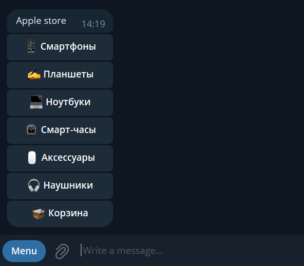

# Apple Store Telegram bot

Pet-проект магазина по продаже техники apple в формате telegram-бота.

## Используемые технологии
* Python 3.8;
* aiogram 3.x (Telegram Bot framework);
* Docker and Docker Compose (контейнеризация);
* PostgreSQL (база данных);
* Redis (хранение данных для работы middleware);
* SQLAlchemy (работа с базой данных с помощью Python);
* Alembic (легкость миграций базы данных);
* Celery (периодичное выполнение задач для работы middleware)
* dependency-injector (удобное внедрение зависимостей)